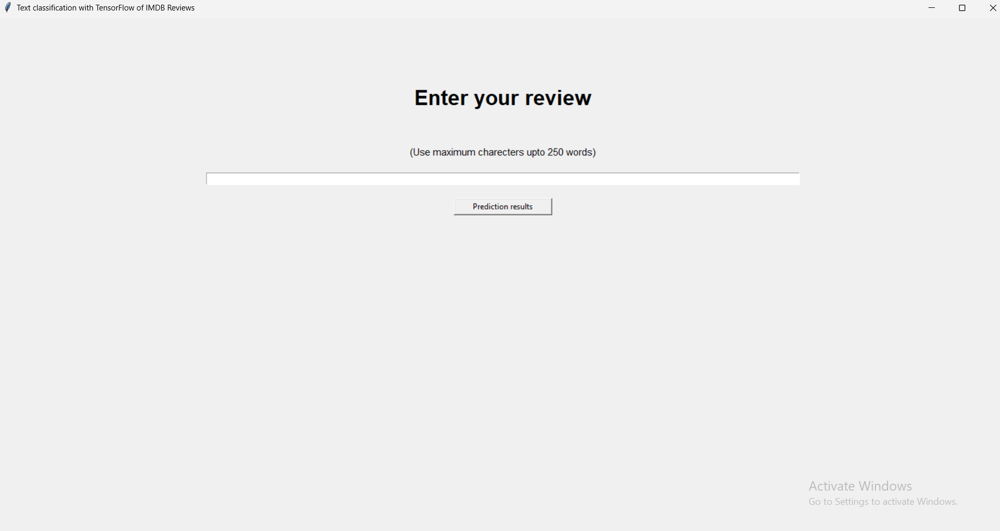
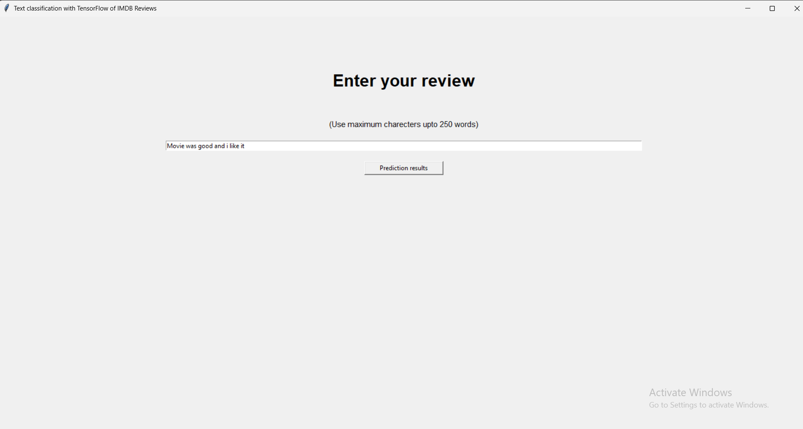
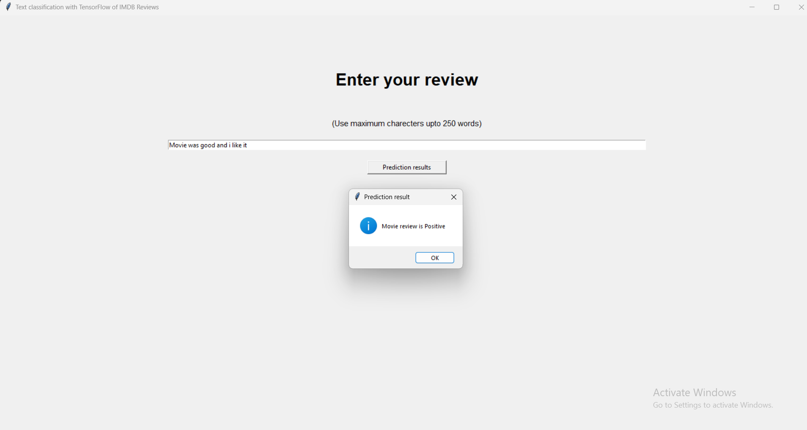
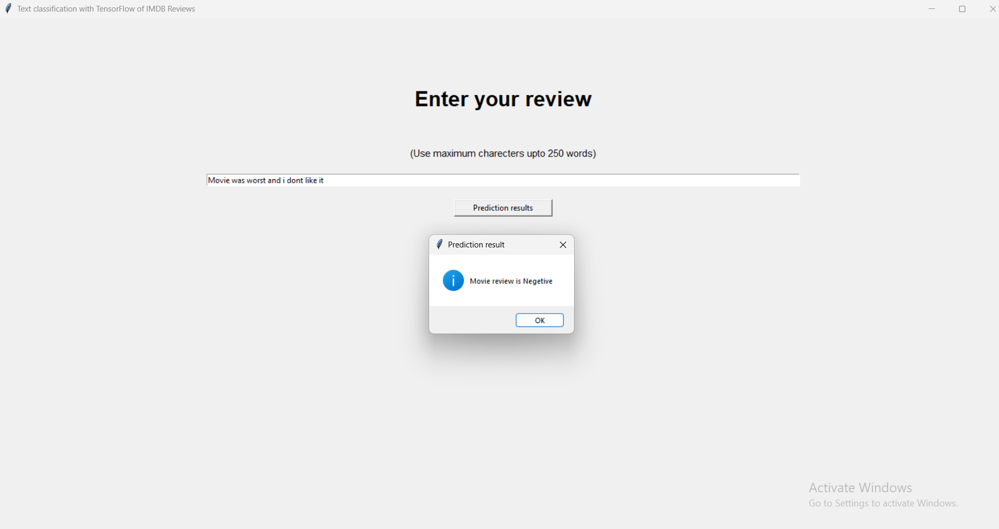

# IMDB Sentiment Analysis for movie reviews with TensorFlow & tkinter

A Python project that predicts movie review sentiment (Positive/Negative) using a deep learning model trained on the IMDB dataset. Built with TensorFlow and tkinter, this project demonstrates modern NLP and web app skills.

---

## 🚀 Features

- Clean and simple UI for sentiment prediction
- train the imdb datasets for prediction analysis
- Fast, lightweight code with easy setup
- Handles text pre-processing,tokenization,padding and embedding
- Clear prediction results with confidence score
- best for small and simple reviews

---

## 📸 Screenshots

<!-- Insert an image like below. Upload screenshots to your repo, then use their GitHub URL. -->

---

## 🛠️ Tech Stack

- Python 3.x
- TensorFlow / Keras
- tkinter
- Pickle
- Visual studio

---

## 📦 Installation

1. **Clone this repository**
https://github.com/vineelpolavarapu/sentiment-analysis-of-IMDB-datasets-for-movie-reviews

2. **Installment requirements**
requirements.txt

3. **Download Model Files**
- `imdb_sentiment_analysis.h5`, `imdb_word_index.pkl` and `maxlen.pkl`.

4. **Run the app locally**

---

## 💡 Usage

- Enter a movie review in the text area.
- Press "Predict Sentiment."
- Get instant Positive/Negative result with confidence!

#### Example Input:

- "Movie was good and i really like it".
- "excellent movie i loved it".
- "bad movie in recent time".
- "worst movie i've ever experience".

#### Example Output:

- "Movie Review is Positive"
- "Movie Review is Negative"

---

## 📝 Project Highlights

- Custom text preprocessing from user and word indexing, simulating real-world NLP pipeline.
- TensorFlow model pre-trained for reliable inference.
- Interactive and simple UI with tkinter, easy for non-technical users.
- Code is well-documented for clarity and learning.

---

## 📂 Repository Structure

   
